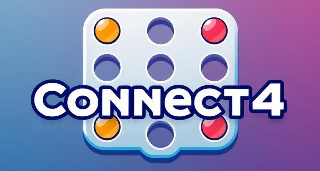
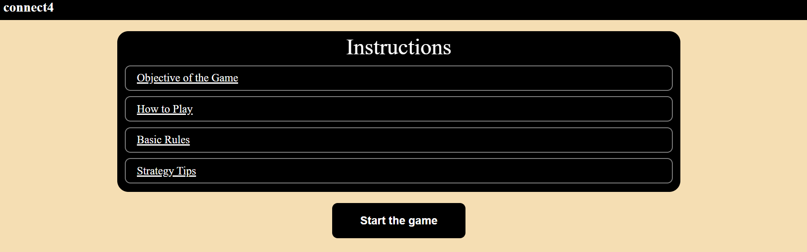
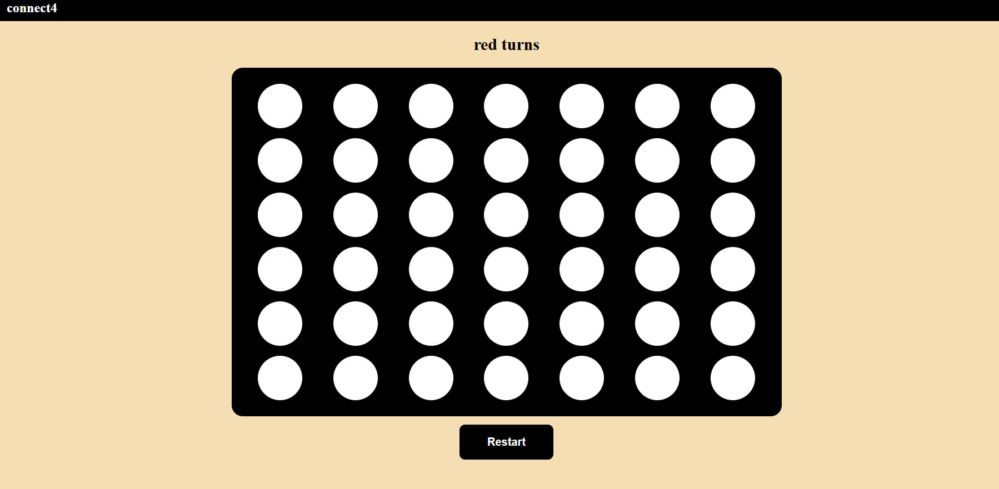

 

# Connect4 
A classic Connect 4 game implementation with [JS].

 

# Description
■ Connect 4 is a two-player board game where players take turns dropping colored discs into a vertical grid. The goal is to get four discs in a row, either horizontally, vertically, or diagonally, before your opponent does.

■ Gameplay: Players drop one disc at a time, trying to create a line of four discs of the same color.

■ Winning condition: The first player to get four discs in a row wins the game.

 

# Background info
■ Connect 4 is a popular tabletop game where two players place colored discs into a grid, aiming to connect four in a row. 
■ Various versions and spin-offs released over the years.

■ I have choose this game to implements because it not so simple to do or very hard to do, it is provide good to hard challenges to do.

 

# Getting started
deployed game link: https://husainnit.github.io/connect4/  

Planning materials:
1. [MockUp](./planning/Mockup.png)
2. [UserStory and Pseudocode](./planning/User-stories-and-Pseudocode.md)

 

inspiration: https://github.com/Kamide/connect-n?tab=readme-ov-file

 

# ScreenShots

 
 

 
 

 
 

 
 

# Technologies Used
■ Figma  
■ HTML 
■ CSS 
■ JavaScript
 

# Future Enhancements
1. add animations to the game
2. add more players colors
3. add sound to the game
4. add counter to counts the winning
5. add 1 vs. bot

